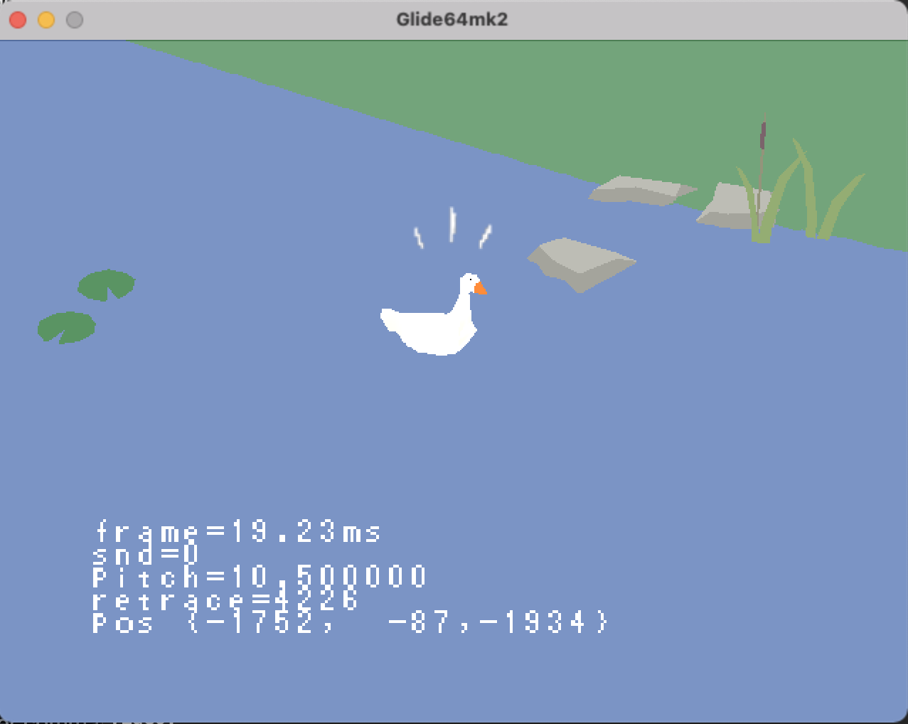

# goose64

this is a demake of untitled goose game for the nintendo 64



## get it

download the [most recent N64 ROM build here](src/goose64.n64)

run it with your favorite emulator or flashcart

## build for emulator/console

### install the n64 sdk & compiler

e.g. https://crashoveride95.github.io/modernsdk/index.html

for example i install the sdk in a docker container on macOS via [colima](https://github.com/abiosoft/colima) + docker, using [this dockerfile](https://gist.github.com/jsdf/21bf1d2c0fd95693c592e998da9e2be9)

### building the game for N64

define machine-specific paths:

```
cp src/localdefs.makefile.example src/localdefs.makefile
```

then edit src/localdefs.makefile to define paths to the N64 SDK:

- `ROOT` (the 'ultra' directory)
- `N64KITDIR` (the 'n64kit' directory)

then run `make`

this produces the rom file `goose64.n64` which you can then run with your favorite emulator or flashcart.

environment variables which affect the build:

- `OPTIMIZE=1`: enable gcc optimization and use non-debug versions of sdk libraries
- `ED64=1`: build with everdrive64 logging support (see [ed64log](https://github.com/jsdf/ed64log)). don't use unless running on an everdrive64

you can also define these in `localdefs.makefile`

## build the desktop opengl version

this repo also includes an opengl based version of the game, which runs on macOS (haven't tested other OSes)

install dependencies:

```
# eg. using homebrew on macOS
brew install glm glew
```

define machine-specific paths

```
cp src/gldefs.makefile.example src/gldefs.makefile
# edit src/gldefs.makefile
```

configure cmake & build

```
cmake -S src/ -B build
cd build
make
./goose64
```

## development

more information about n64 programming can be found in [N64SDK](N64SDK.md) and [ART](ART.md).

### deploy to everdrive and start logging

with everdrive64 v3 inserted and usb cable connected, reset console and run:

```
./deploy.sh
```

if you get a 'device not found' error, check that 'FT245R USB FIFO' is visible in your system's list of connected usb devices

### regenerate n64 header files from the OBJ models

if you update .obj model files:

first make sure you have lua installed

```
# eg. using homebrew on macOS
brew install lua
```

then, to rebuild model header files

```
./rebuild_models.sh
```

### regenerate n64 header files for sprites

if you update any texture files:

make sure you have python and pillow installed

```bash
pip install pillow
```

then, to rebuild sprites

```bash
./sprites.sh
```

### export map object data

- open blender (or use `./blender.sh` to see console output)
- in the blender text editor editor, open and run export_positions.py then open and run export_collision_mesh.py
- see header files are created
